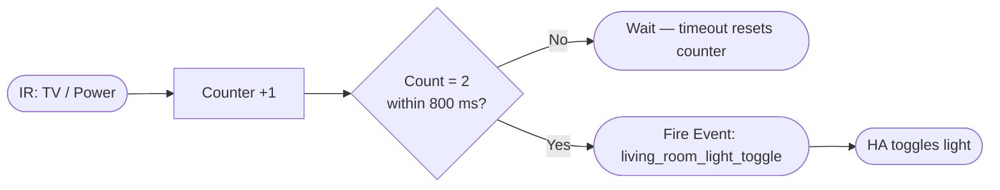
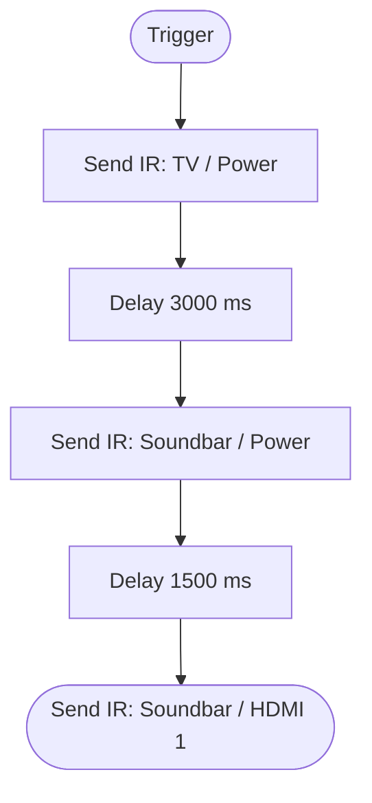
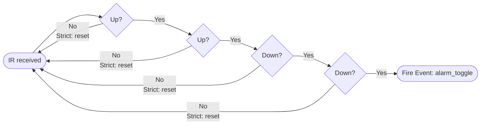
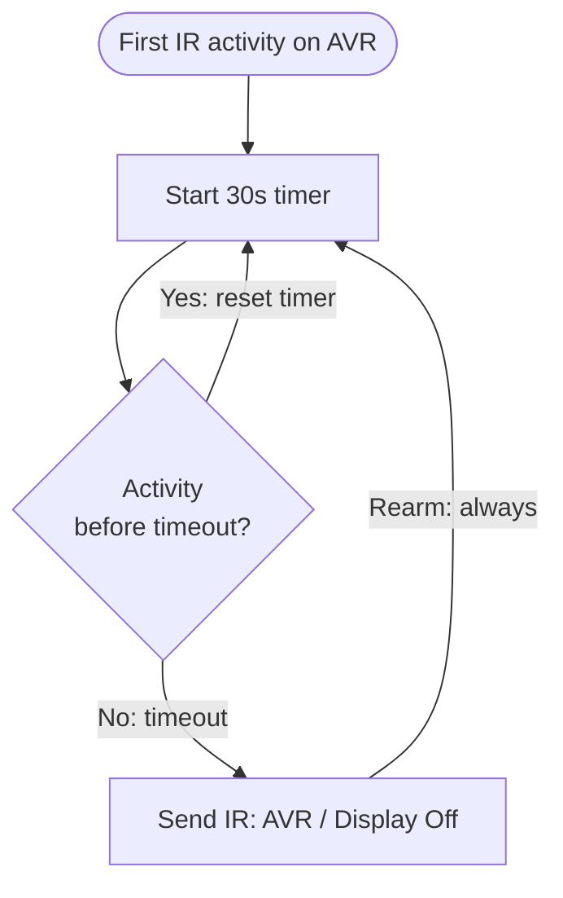
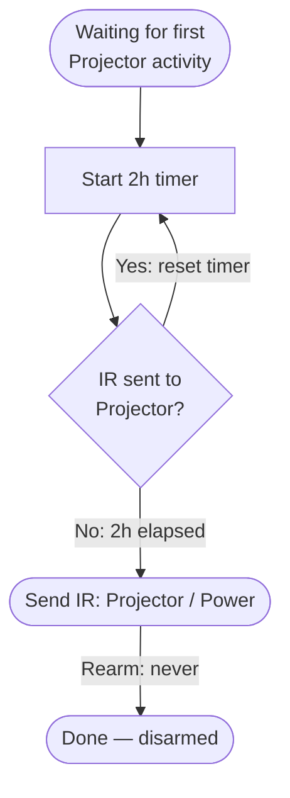
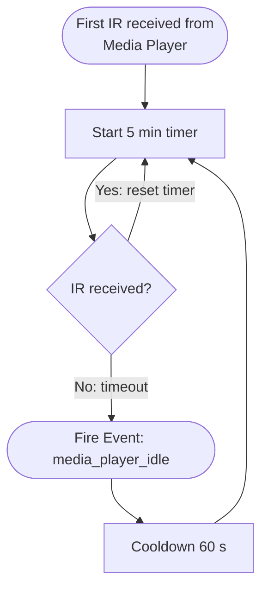

# Automations

Automations allow you to define logic that runs directly on the IR2MQTT backend, reducing latency compared to round-tripping through Home Assistant.

## Triggers
- **Single Press:** Runs immediately when a specific button code is received.
- **Multi Press:** Runs only after a button is pressed X times within a time window (e.g., Double Click). *Strict Mode:* Resets progress if any other button is pressed in between.
- **Sequence:** Runs when a specific sequence of buttons is pressed (e.g., "Up, Up, Down, Down"). Useful for secret codes or complex commands.
- **Device Inactivity:** Runs after a configurable period of silence on a device — no buttons received or sent within the timeout. Useful for "idle" actions like turning off a display after the user stops interacting.

### Device Inactivity Options

| Option | Description |
|--------|-------------|
| **Device** | Which device to watch for activity. |
| **Timeout** | How many seconds of silence before the trigger fires. |
| **Watch Mode** | What counts as activity: `received` (IR codes received from the device), `sent` (IR codes sent to the device), or `both`. |
| **Rearm Mode** | What happens after the trigger fires: `always` (arm again immediately), `cooldown` (wait a fixed time before rearming), `never` (fire once and stop). |
| **Cooldown** | Seconds to wait before rearming (only relevant when Rearm Mode is `cooldown`). |
| **Button Whitelist** | If set, only these buttons count as activity (all others are ignored). |
| **Button Blacklist** | If set, these buttons are ignored when tracking activity. |
| **Require Initial Activity** | When enabled (default), the timer only starts after the first button is seen. When disabled, the timer starts as soon as the automation loads. |
| **Ignore Own Actions** | When enabled (default), IR codes sent by *this* automation do not reset the inactivity timer — preventing the automation from rearming itself indefinitely. |

The UI shows a live countdown bar and highlights when the trigger fires or enters cooldown.

## Execution Options
- **Parallel Execution:** By default, an automation waits for the previous run to finish before starting again. Enable this to allow multiple instances to run simultaneously.

## Actions
- **Send IR:** Transmit another IR code.
- **Delay:** Wait for a specified duration (milliseconds).
- **Fire Event:** Send a custom event to MQTT/Home Assistant to trigger external logic.

---

## Recipes

Common use cases you can build with automations.

### Double-Click Power to Toggle a Light

**Goal:** A double-click on the TV remote's Power button fires a Home Assistant event that toggles a light — without any HA automation delay.

| Field | Value |
|-------|-------|
| Trigger | Multi Press — `TV / Power`, count: **2**, window: 800 ms |
| Action | Fire Event — name: `living_room_light_toggle` |

In Home Assistant, create an automation triggered by the MQTT device trigger `living_room_light_toggle` on the IR2MQTT device.

---

### Chained IR Blast (TV + Soundbar + Input)

**Goal:** One button press turns on the TV, waits for it to boot, then switches the soundbar to HDMI input.

| Step | Action |
|------|--------|
| 1 | Send IR — `TV / Power` |
| 2 | Delay — 3000 ms |
| 3 | Send IR — `Soundbar / Power` |
| 4 | Delay — 1500 ms |
| 5 | Send IR — `Soundbar / HDMI 1` |

:::tip Parallel Execution
Disable **Parallel Execution** for this automation so that rapid button presses don't stack multiple blasts on top of each other.
:::

---

### Secret Code to Arm/Disarm

**Goal:** Press Up → Up → Down → Down on any remote to fire a "secret" event (e.g., arm an alarm).

| Field | Value |
|-------|-------|
| Trigger | Sequence — `Up`, `Up`, `Down`, `Down` |
| Action | Fire Event — name: `alarm_toggle` |

:::tip Strict Mode
Enable **Strict Mode** on the trigger so that pressing any other button resets the sequence progress. This prevents accidental triggers.
:::

---

### Volume Repeat with Delay

**Goal:** A single "Volume Up" press on a custom button sends the code three times in quick succession (for devices that need multiple pulses).

| Step | Action |
|------|--------|
| 1 | Send IR — `Amplifier / Volume Up` |
| 2 | Delay — 150 ms |
| 3 | Send IR — `Amplifier / Volume Up` |
| 4 | Delay — 150 ms |
| 5 | Send IR — `Amplifier / Volume Up` |

---

### Triple-Click for a Scene

**Goal:** Triple-click the bedroom remote's OK button to trigger a "Good Night" scene in Home Assistant.

| Field | Value |
|-------|-------|
| Trigger | Multi Press — `Bedroom Remote / OK`, count: **3**, window: 1000 ms |
| Strict Mode | Enabled |
| Action | Fire Event — name: `scene_good_night` |

In Home Assistant, handle `scene_good_night` to dim lights, lock doors, and set the thermostat.

---

### AVR Display Off After Inactivity

**Goal:** An AV receiver turns on its front display with every IR command. After 30 seconds of no interaction, automatically send the "Display Off" code.

| Field | Value |
|-------|-------|
| Trigger | Device Inactivity — `AVR`, timeout: **30 s** |
| Watch Mode | `both` (received + sent) |
| Rearm Mode | `always` |
| Ignore Own Actions | Enabled — so the "Display Off" send does not reset the timer |
| Action | Send IR — `AVR / Display Off` |

:::tip Ignore Own Actions
Keep **Ignore Own Actions** enabled. Without it, sending "Display Off" would count as activity and immediately restart the 30-second countdown, causing the timer to loop forever.
:::

---

### Auto-Sleep a Projector

**Goal:** If no IR commands have been sent to the projector for 2 hours, send a "Power Off" command — in case someone forgot.

| Field | Value |
|-------|-------|
| Trigger | Device Inactivity — `Projector`, timeout: **7200 s** |
| Watch Mode | `sent` |
| Rearm Mode | `never` — fire once per session |
| Require Initial Activity | Enabled — only start the timer after the projector was actually used |
| Action | Send IR — `Projector / Power` |

---

### Notify on Idle Device

**Goal:** After 5 minutes of silence on a media device, fire an MQTT event that Home Assistant uses to dim the lights (indicating nothing is playing).

| Field | Value |
|-------|-------|
| Trigger | Device Inactivity — `Media Player`, timeout: **300 s** |
| Watch Mode | `received` |
| Rearm Mode | `cooldown`, cooldown: **60 s** |
| Action | Fire Event — name: `media_player_idle` |

